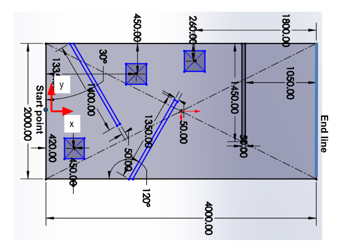
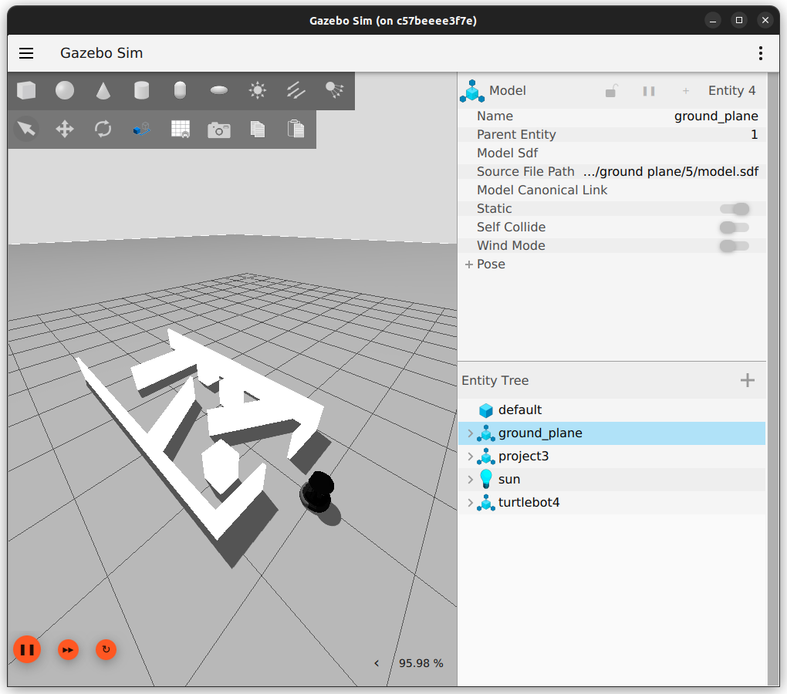

# ENPM661 Project 3 Phase 2

This repository contains the source code and configuration files for the ENPM661 Project 3 Phase 2. The project is built using ROS 2 Jazzy and leverages various dependencies to simulate and control turtlebot4.

Autonomous Navigation : Write your script to navigate turtlebot4 through the maze. Make sure to modify CMakeLists.txt file accordingly

# Setup:

If you don't have ROS2 Jazzy installed on your local machine, you can use this docker cintainer to test your code.
Follow: [Docker Setup](#running-on-docker)

If you have ROS2 Jazzy installed, you can directly clone, build and run the simulation.
Follow: [Source Setup](#installation-and-launching-gazebo-on-ros2-jazzy)


## Dependencies

The project depends on the following ROS 2 packages:

- `ament_cmake`
- `geometry_msgs`
- `ros_gz_interfaces`
- `rclcpp`
- `nav_msgs`
- `tf2`
- `sensor_msgs`

Ensure these dependencies are installed in your ROS 2 environment.

## Running on Docker

1. Download docker image

    ```bash
    docker pull ghcr.io/koustubh1012/enpm661_competition:latest

2. Run the docker image
    ```bash
    xhost +local:docker  # Allow Docker to access X server
    docker run -it   --env DISPLAY=$DISPLAY   --volume /tmp/.X11-unix:/tmp/.X11-unix:rw   --privileged   ghcr.io/madhav2133/enpm661:latest   /bin/bash

3. Build and run the ROS2 package
    ```bash
    cd ~/ros2_ws/
    colcon build
    source /opt/ros/jazzy/setup.bash
    source install/setup.bash
    ros2 launch enpm661_competition turtlebot4_gz.launch.py

## Installation and Launching Gazebo on ROS2 Jazzy

1. Clone the repository into your working directory:
   ```bash
   https://github.com/koustubh1012/enpm661_competition.git
2. Build the package using Colcon build
    ```bash
    colcon build 
3. Source the overlay and underlay

    ```bash
    source /opt/ros/jazzy/setup.bash
    source install/setup.bash
4. Launch the Gazebo setup using the launch file
    ```bash
    ros2 launch enpm661_competition turtlebot4_comp.launch.py

## Map Dimensions

All dimensions are in milimeters.



## Simulation

You should see the turtlebot4 along with the maze in gazebo sim



## Useful Information

### Teleoperation

The tutlebot4 subscribes to cmd_vel in namespace. For eg if namespace of robot is tb4_1 then topics will be /tb4_1/<topics>.

Example to teleop TB4 with namespace tb4_1

```bash
ros2 run teleop_twist_keyboard teleop_twist_keyboard --ros-args -p stamped:=true -r /cmd_vel:=/tb4_1/cmd_vel
```

### Docker

1. To build the docker image using docker compose
    ```bash
    USERUID=$(id -u) USERGID=$(id -g) docker compose -f docker/enpm661-comp.yml build

2. To make container
    ```bash
    docker compose -f docker/enpm661-comp.yml run --rm enpm661-comp-docker
NOTE: use sudo inside docker just like native.

### Add new Python executable

* Write a new python script and store it in a folder
* Update the CMakeLists.txt file 

```xml
# Install python scripts

install(PROGRAMS 
  scripts/teleop.py
  # You can add more scripts here
  DESTINATION lib/${PROJECT_NAME}
)
```